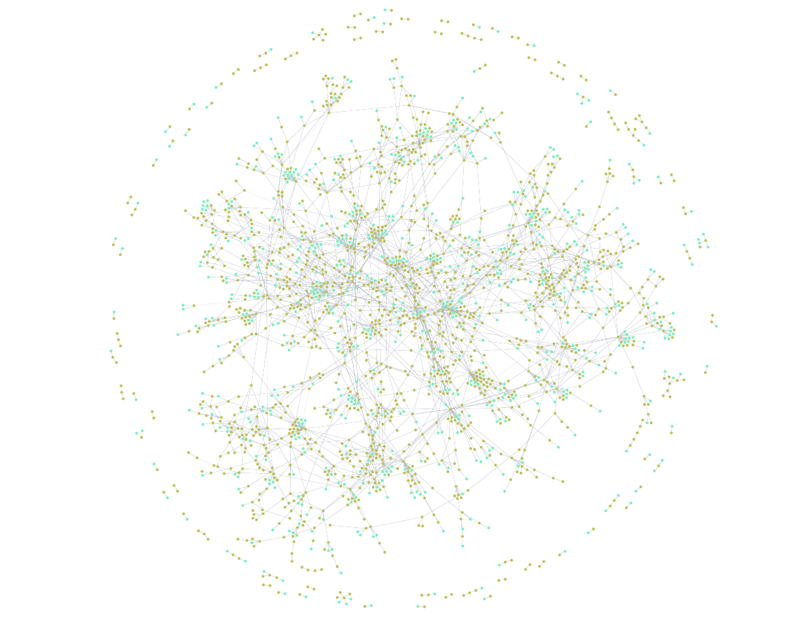

# Knowledge Graph-Augmented RAG System for Adaptive Learning

**Course:** Application Of Language Modeling(AoLM)  
**Team:** CLD Duos  
**Members** Aaditya Bhatia(2023114012), Aryan Chaudhary(2023114015)

---

## Table of Contents

1. [Overview](#1-overview)
2. [Knowledge Graph Construction](#2-knowledge-graph-construction)
   - 2.1 [Source Material](#21-source-material)
   - 2.2 [PDF Parsing and Semantic Chunking](#22-pdf-parsing-and-semantic-chunking)
   - 2.3 [LLM-Based Entity and Relation Extraction](#23-llm-based-entity-and-relation-extraction)
   - 2.4 [Extraction Prompt Design](#24-extraction-prompt-design)
   - 2.5 [Neo4j Ingestion](#25-neo4j-ingestion)
   - 2.6 [Knowledge Graph Statistics](#26-knowledge-graph-statistics)
3. [Knowledge Graph Visualisation](#3-knowledge-graph-visualisation)
4. [RAG Engine Architecture](#4-rag-engine-architecture)
   - 4.1 [Query and Context Building](#41-query-and-context-building)
   - 4.2 [User Simulation](#42-user-simulation)
   - 4.3 [Prompt Injection Strategy](#43-prompt-injection-strategy)
5. [Evaluation Setup](#5-evaluation-setup)
6. [Results: Response Differences With and Without RAG](#6-results-response-differences-with-and-without-rag)
   - 6.1 [Scenario 1 — Prerequisite Awareness (Same Question, Different Users)](#61-scenario-1--prerequisite-awareness-same-question-different-users)
   - 6.2 [Scenario 2 — Factual Depth and Misconception Coverage](#62-scenario-2--factual-depth-and-misconception-coverage)
   - 6.3 [Scenario 3 — Analogical Bridging (Expert in X, New to Y)](#63-scenario-3--analogical-bridging-expert-in-x-new-to-y)
7. [Prerequisite Processing: How RAG Handles Knowledge Gaps](#7-prerequisite-processing-how-rag-handles-knowledge-gaps)
8. [Analogical Reasoning: How RAG Builds Better Bridges](#8-analogical-reasoning-how-rag-builds-better-bridges)
9. [Summary of Improvements](#9-summary-of-improvements)
10. [Conclusion](#10-conclusion)

---

## 1. Overview

This project builds an **Adaptive Learning System** for Data Structures and Algorithms (DSA) by combining two technologies: a **Knowledge Graph (KG)** extracted from the CLRS textbook and a **Large Language Model (LLM)** running locally. The core idea is that a plain LLM, while knowledgeable, has no awareness of *who* is asking or *what* they already know. By grounding the LLM in a structured KG that encodes prerequisites, concept relationships, and common misconceptions, the system can personalise its explanations to each learner.

The pipeline works in two phases:

1. **Offline Phase (KG Construction):** The CLRS textbook is parsed, chunked semantically, and each chunk is processed by Google Gemini 2.5 Pro to extract concepts, relationships, and misconceptions into a Neo4j graph database.

2. **Online Phase (RAG Inference):** When a student asks a question, the KG is queried for the relevant concept's context (prerequisites, subtypes, misconceptions, what it unlocks), this context is injected into the LLM prompt alongside the student's profile, and Qwen 2.5 7B generates a tailored response.

---

## 2. Knowledge Graph Construction

### 2.1 Source Material

The source textbook is:

> **Introduction to Algorithms, 3rd Edition**  
> Thomas H. Cormen, Charles E. Leiserson, Ronald L. Rivest, Clifford Stein  
> MIT Press — commonly referred to as **CLRS**

CLRS is the gold standard reference for algorithms and data structures, used in universities worldwide. It is a 1,313-page book covering sorting, graph algorithms, dynamic programming, data structures, number-theoretic algorithms, and much more. It was chosen because:

- It is highly structured with numbered chapters and sections (e.g., `13.3 Insertion into a red-black tree`)
- It explicitly discusses prerequisites, properties, and common pitfalls
- Its depth makes it an ideal source for a pedagogical KG

---

### 2.2 PDF Parsing and Semantic Chunking

The PDF is parsed using **PyMuPDF (fitz)**, which extracts text block-by-block, preserving the reading order of each page. A naive full-text split would lose section boundaries, so a **semantic chunking** approach was used instead.

CLRS section headings follow a consistent pattern — for example:

```
1  The Role of Algorithms in Computing
1.1  Algorithms
Chapter 13  Red-Black Trees
13.1  Properties of red-black trees
```

This pattern is captured with the regular expression:

```python
HEADING_RE = re.compile(
    r"^(?:Chapter\s+)?\d+(?:\.\d+)*\s{2,}.+$",
    re.MULTILINE,
)
```

The full text is split on every matched heading, producing one chunk per section. Sections longer than **4,000 characters** (~1,000 tokens) are further split on paragraph boundaries (`\n\n`) to stay within token limits without cutting in the middle of a concept. Chunks shorter than **100 characters** (e.g., table-of-contents entries and page number lines) are filtered out before processing.

**Result:** 1,018 meaningful semantic chunks from 1,313 pages.

---

### 2.3 LLM-Based Entity and Relation Extraction

Chunks are processed in **batches of 5** (approximately 20,000 characters per batch) by **Google Gemini 2.5 Pro** via the `google-genai` SDK. The REST transport (`api_version="v1beta"`) was used instead of gRPC to ensure stability on restricted networks.

The model was chosen for its:
- **Superior reasoning ability** — needed to infer implicit relationships
- **Large context window** — handles multi-section batches comfortably
- **JSON output reliability** — critical for structured extraction

**Rate limiting and retries:** Exponential backoff with up to 6 retries was implemented to handle `429 RESOURCE_EXHAUSTED` errors. A `progress.json` file tracks the last successfully processed chunk, allowing the pipeline to resume from where it left off after quota resets or network failures.

---

### 2.4 Extraction Prompt Design

Each batch call sends the combined text of 5 sections with the following prompt:

```
You are an expert Data Structures & Algorithms Curriculum Designer.
Analyse the following educational text from the CLRS textbook
"Introduction to Algorithms". It contains {N} sections.

TEXT TO ANALYSE:
"""
[Section: {title_1}]
{text_1}

---

[Section: {title_2}]
{text_2}
...
"""

Identify three things across ALL sections:

1. CONCEPTS: Key technical terms
   (e.g., "Binary Search Tree", "Amortized Analysis", "Dynamic Programming").
   Assign each a SHORT snake_case unique id (e.g., "binary_search_tree").

2. RELATIONSHIPS between concepts:
   - "REQUIRES"   : Concept A requires understanding Concept B as a prerequisite.
   - "SUBTYPE_OF" : Concept A is a specialised type / variant of Concept B.
   - "USES"       : Concept A employs Concept B as a technique or data structure.

3. MISCONCEPTIONS: Common mistakes or confusing points explicitly mentioned
   or strongly implied in the text.

Rules:
- Only include items clearly supported by the provided text.
- Every concept id used in relationships MUST also appear in the concepts list.
- Return ONLY a raw JSON object — no markdown fences, no extra text.

Required JSON structure:
{
    "concepts": [
        {"id": "snake_case_id", "name": "Human Readable Name",
         "definition": "One-sentence definition"}
    ],
    "relationships": [
        {"source": "id_a", "target": "id_b", "type": "REQUIRES"},
        {"source": "id_a", "target": "id_b", "type": "SUBTYPE_OF"},
        {"source": "id_a", "target": "id_b", "type": "USES"}
    ],
    "misconceptions": [
        {"concept_id": "snake_case_id",
         "description": "Description of the common error"}
    ]
}
```

**Key design decisions in this prompt:**

- **Role assignment** ("expert DSA curriculum designer") — steers Gemini towards pedagogical extraction rather than generic summarisation.
- **Three-category schema** — separates factual concepts, structural relationships, and pedagogical misconceptions, which a plain summarisation prompt would conflate.
- **Strict JSON-only output rule** — prevents markdown fencing or explanatory preamble that would break the JSON parser.
- **Section labels in the batch text** — gives the model context about where each excerpt came from, helping it attribute relationships correctly.
- **Explicit relationship semantics** — REQUIRES, SUBTYPE_OF, and USES are defined clearly so the model does not conflate "a specialisation" with "a prerequisite."

---

### 2.5 Neo4j Ingestion

The extracted JSON is pushed to a **Neo4j Aura** cloud instance using idempotent `MERGE` statements (so the pipeline can safely re-run without creating duplicate nodes). Three types of data are stored:

```cypher
-- Concept nodes
MERGE (c:Concept {id: $id})
SET c.name = $name, c.definition = $definition

-- Dependency relationships
MATCH (a:Concept {id: $source}), (b:Concept {id: $target})
MERGE (a)-[:REQUIRES]->(b)
-- (similarly for SUBTYPE_OF and USES)

-- Misconception nodes linked to concepts
MERGE (m:Misconception {description: $desc})
MERGE (c:Concept {id: $cid})-[:HAS_MISCONCEPTION]->(m)
```

---

### 2.6 Knowledge Graph Statistics

After processing all 1,018 chunks across 204 API calls to Gemini 2.5 Pro, the final KG contains:

| Entity / Relationship | Count |
|---|---|
| Concept nodes | **1,829** |
| Misconception nodes | **709** |
| USES relationships | **1,072** |
| HAS_MISCONCEPTION relationships | **709** |
| REQUIRES relationships | **648** |
| SUBTYPE_OF relationships | **508** |
| **Total relationships** | **2,937** |

This means the KG captures not just *what* the book says, but *how concepts connect to each other* — forming a genuine dependency graph that can drive adaptive tutoring.

---

## 3. Knowledge Graph Visualisation

The following visualisation shows a portion of the extracted Knowledge Graph, rendered from Neo4j. Each node represents a concept from CLRS, and the directed edges represent the three relationship types — **REQUIRES** (prerequisite dependency), **SUBTYPE_OF** (taxonomic hierarchy), and **USES** (algorithmic technique usage).



Nodes clustered in the centre represent highly interconnected foundational concepts such as *Binary Tree*, *Graph*, *Sorting*, and *Recursion* — concepts that are prerequisites for a very large number of other topics. Peripheral nodes represent more specialised topics like *Red-Black Tree Deletion* or *Fibonacci Heap Decrease-Key* that have many incoming prerequisite edges but few outgoing ones.

The **Misconception nodes** (not shown in this view for clarity) are connected via `HAS_MISCONCEPTION` edges and provide the RAG engine with a curated list of common errors to proactively address in explanations.

---

## 4. RAG Engine Architecture

### 4.1 Query and Context Building

When a student asks a question about a topic (e.g., `"dijkstra"`), the RAG engine queries Neo4j to retrieve:

1. **Concept definition and section reference** from CLRS
2. **Direct prerequisites** — concepts that must be understood first (`REQUIRES` edges outgoing)
3. **What this topic unlocks** — concepts that build upon it (`REQUIRES` edges incoming)
4. **Subtypes** — variants and specialisations (`SUBTYPE_OF` edges)
5. **Techniques used** — algorithms or structures it relies on (`USES` edges)
6. **Misconceptions** — common errors associated with this concept (`HAS_MISCONCEPTION` edges)

The matching is done using a **fuzzy `CONTAINS` match** in Cypher:

```cypher
MATCH (c:Concept)
WHERE toLower(c.name) CONTAINS toLower($topic)
   OR toLower(c.id)   CONTAINS toLower($topic)
RETURN c.id, c.name, c.definition, c.section
LIMIT 5
```

This tolerates partial topic names and small typos in student queries without requiring exact string matching.

---

### 4.2 User Simulation

A core feature of this system is **user profiling**. Each simulated user carries a profile with:

```python
user = {
    "name":         "Alice",
    "score":        8,                # self-reported proficiency 0–10
    "level":        "advanced",       # derived: 0-3 = beginner, 4-6 = intermediate, 7-10 = advanced
    "known_topics": ["Binary Search Tree", "Tree Rotation", "Sorting"],
}
```

The `known_topics` list is matched against the KG's prerequisite list for the queried concept. Each prerequisite is annotated:

```
Prerequisites (must know before this):
  - Binary Search Tree: A tree data structure with BST property.  ✓ (user knows this)
  - Tree Rotation: A local structure-preserving transformation.   ✓ (user knows this)
  - Height-Balanced Tree: A tree with bounded height.             ✗ (user may NOT know this)
```

This prerequisite gap analysis is what makes the system **adaptive** — the LLM is told exactly what the student does and does not know before generating the answer.

Three student archetypes were simulated for evaluation:

| User | Score | Level | Known Topics | Query |
|---|---|---|---|---|
| **Alice** | 8/10 | Advanced | BST, Rotations, Sorting | Red-Black Tree insertion |
| **Bob** | 2/10 | Beginner | *(nothing)* | Red-Black Tree insertion |
| **Charlie** | 5/10 | Intermediate | Arrays, Recursion, Sorting, Graph | Dijkstra, DP, Amortized Analysis |
| **Diana** | 2/10 (on DP) | Beginner (DP) | Merge Sort, D&C, Recursion, Recurrence | Dynamic Programming |

---

### 4.3 Prompt Injection Strategy

Two LLM calls are made for every question — one **without** RAG and one **with** RAG — so results can be directly compared.

**Without RAG:** A plain system prompt is used:
```
You are a helpful DSA tutor. Answer the student's question clearly and concisely.
```

**With RAG:** The full KG context, user profile, and proficiency-level instructions are injected:
```
You are an adaptive DSA tutor powered by a Knowledge Graph from the CLRS textbook.

=== Knowledge Graph Context ===
Topic: Red-Black Tree
Definition: A balanced BST where each node has an extra bit for colour...
Section in CLRS: Chapter 13

Prerequisites (must know before this):
  - Binary Search Tree: ...  ✓ (user knows this)
  - Tree Rotation: ...       ✗ (user may NOT know this)

⚠ Common Misconceptions to address:
  - Insertion always requires a double rotation followed by recoloring.
  - Only direct descendants of the inserted node can cause violations.

User proficiency level: beginner
User already knows: (nothing)

Instruction: Use simple language, avoid jargon, explain from scratch.
- If the user is missing prerequisites, WARN them and briefly explain those first.
- Highlight common misconceptions relevant to this topic.
- Tailor your explanation to their proficiency level.
```

The LLM — **Qwen 2.5 7B** running locally via Ollama — then generates a response that is structurally constrained by this rich context.

---

## 5. Evaluation Setup

| Parameter | Value |
|---|---|
| **KG Extraction Model** | Google Gemini 2.5 Pro |
| **Response Generation Model** | Qwen 2.5 7B (via Ollama, local) |
| **Knowledge Graph DB** | Neo4j Aura (cloud) |
| **Evaluation Date** | 19 February 2026 |
| **Scenarios** | 3 (6 user-question pairs + 3 repeated questions) |
| **Questions evaluated** | 6 distinct questions |

Each question was answered **twice** — once by the plain Qwen 2.5 7B and once by the KG-augmented version — and the outputs were saved to `evaluation_results.txt` for qualitative analysis.

---

## 6. Results: Response Differences With and Without RAG

### 6.1 Scenario 1 — Prerequisite Awareness (Same Question, Different Users)

**Question:** *"How does a Red-Black Tree maintain balance after insertion?"*

Both Alice (advanced, knows prerequisites) and Bob (beginner, knows nothing) asked the exact same question.

---

#### Alice — Without RAG:

The plain LLM gave a technically adequate answer describing the four insertion cases, rotations, and recolouring. It made no acknowledgement of Alice's advanced level and gave a generic overview-style answer. The response was essentially the same template it would give to anyone:

> *"By following these steps, the Red-Black Tree ensures that after any insertion, all properties are maintained, thus keeping the tree balanced and efficient for operations like search, insert, and delete."*

#### Alice — With RAG:

The RAG-augmented response immediately acknowledged her proficiency level and adjusted the tone accordingly:

> *"Given your advanced proficiency level, I'll provide a concise technical explanation focusing on the nuances and edge cases..."*

It then went on to discuss specific **violation cases** with named sub-cases, discussed the **propagation of violations up the tree**, covered the **edge case of an empty tree insertion**, and proactively addressed two misconceptions sourced directly from the KG:

> *"Misconception 1: Insertion always requires a double rotation followed by recoloring.*  
> *Correction: The specific operation depends on the current tree structure. Single or even no rotations might be necessary in some cases..."*

This misconception was never mentioned in the plain LLM's response.

---

#### Bob — Without RAG:

The plain LLM gave Bob the exact same depth of explanation it gave Alice. It assumed he knew what a "black height" was, what "fixup operations" meant, and that he understood the four Red-Black properties. There was no scaffolding whatsoever:

> *"These operations are known as 'fixup' operations and ensure that the Red-Black Tree remains balanced. The goal is always to maintain the black height and the 4 properties of a Red-Black Tree after any insertion."*

A beginner student who does not know what a Binary Search Tree is would be completely lost here.

#### Bob — With RAG:

The RAG version detected that Bob had **no known prerequisites** and started from scratch — explaining BSTs first before introducing Red-Black Trees:

> *"Sure! Let's start by ensuring you have a good grasp of binary search trees (BSTs) before diving into Red-Black Trees."*

It defined what a BST is, introduced the colouring rules simply ("no two red nodes in a row"), gave a step-by-step walkthrough of the insertion scenario, and ended with a friendly check-in:

> *"Does this help clarify how Red-Black Trees maintain their balance? If you have any more questions or need further examples, feel free to ask!"*

**Key Observation:** Without RAG, Alice and Bob received almost identical responses. With RAG, the two responses were structurally and tonally completely different — appropriate to each student's knowledge level and background.

---

### 6.2 Scenario 2 — Factual Depth and Misconception Coverage

**User:** Charlie (intermediate student, knows Arrays, Recursion, Sorting, Graph)

#### Q2a: "What is the time complexity of Dijkstra's algorithm?"

**Without RAG** — The answer was factually correct but very brief (2 sentences). It mentioned `O((E + V) log V)` with a binary heap and `O(E + V log V)` with a Fibonacci heap but gave no explanation of *why* these complexities hold:

> *"The time complexity of Dijkstra's algorithm depends on the data structures used for the graph and the priority queue. Using an adjacency list... the most common implementation with a binary heap has a time complexity of O((E + V) log V)..."*

**With RAG** — The response was significantly richer. It started from the naive `O(E + V²)` unsorted array implementation, derived the `O((E + V) log V)` binary heap complexity step by step (relax cost, number of iterations), and then addressed **three common misconceptions** pulled from the KG:

> *"Misconception: Dijkstra's Algorithm Works on Graphs with Negative-Weight Edges. This is incorrect. Dijkstra's algorithm is designed for graphs where all edge weights are non-negative..."*

> *"Misconception: Relaxation Order — Dijkstra's Algorithm relaxes the edges of a shortest path in the sequential order they appear on that path. Fact: Relaxations occur based on the current minimum distance to each vertex..."*

These misconceptions are the sort of mistakes that intermediate students commonly make, and the KG's `HAS_MISCONCEPTION` edges brought them directly into the response.

---

#### Q2b: "What is amortized analysis and when do you use it?"

**Without RAG** — The plain LLM answered in 4 sentences:

> *"Amortized analysis is a technique... It provides an overall measure of the cost across a whole sequence of operations... Common scenarios include dynamic arrays..."*

There was no mention of the three formal methods (Aggregate, Accounting, Potential Function).

**With RAG** — The response covered all three methods in dedicated subsections:

> *"**Aggregate Analysis:** This method calculates the total cost of a sequence of n operations and then divides by n..."*
>
> *"**Accounting Method:** In this method, you assign different charges (or 'credit') to operations..."*
>
> *"**Potential Function Method:** This involves defining a potential function Φ that captures the 'potential energy' of the data structure state..."*

Additionally, three misconceptions were addressed, including the subtle but important one:

> *"Misconception: Amortized analysis vs. Average-Case Analysis — Amortized analysis does not involve probability or assumptions about input distributions. It guarantees the average performance in the worst case..."*

This is an extremely common confusion that students have, and the KG's structured misconception nodes made it appear in the response automatically.

---

### 6.3 Scenario 3 — Analogical Bridging (Expert in X, New to Y)

**User:** Diana (score 2 on DP, but expert in Merge Sort, Divide and Conquer, Recursion)  
**Question:** *"I understand Merge Sort very well. Can you explain Dynamic Programming to me in a way that connects to what I already know?"*

This scenario tests whether the RAG system can use the student's existing knowledge as an **anchor** to explain a new concept through analogy.

---

**Without RAG:**

The plain LLM did attempt a Merge Sort → DP analogy, but it was **generic and not grounded** in Diana's actual knowledge. It mapped Divide-Conquer-Combine to DP at a surface level but did not use her specific known topics (Recursion, Recurrence, Time Complexity) as explicit bridges:

> *"Dynamic Programming is another technique used for solving problems by breaking them down into simpler subproblems, much like in Merge Sort. However, there are key differences and similarities: **Divide** — In DP, you also break down a problem into smaller subproblems, but these subproblems might overlap..."*

The response was structured but felt mechanical. It did not say "since you understand **recurrence relations** from Merge Sort's T(n) = 2T(n/2) + O(n), DP uses similar recurrences..." — it stayed at the conceptual label level.

---

**With RAG:**

The RAG-augmented response used Diana's specific known topics as named anchors throughout the explanation. The KG had told the system that Diana knows `["Merge Sort", "Divide and Conquer", "Recursion", "Sorting", "Time Complexity", "Recurrence"]`, and this was woven directly into the explanation:

> *"Let's break down dynamic programming in a way that connects it to what you already know about **recursion, merge sort, and divide-and-conquer**."*

> *"Just like in divide-and-conquer algorithms (like merge sort), you break down a problem into smaller parts. However, in dynamic programming, some of these smaller problems overlap..."*

> *"Imagine you're solving a puzzle and every time you reach a certain point, you write down your solution so you don't have to do it again. That's what memoization does in DP. This is similar to the divide-and-conquer approach where you solve each subproblem only once, but in DP, this saves even more computations by caching results."*

The RAG version also included concrete Python code examples (something the plain LLM also did, but the RAG version contextualised it better), and it was careful to address the DP-specific misconception pulled from the KG:

> *"The term 'programming' here doesn't mean writing code! It refers to a method for solving problems by breaking them into simpler subproblems and storing their solutions."*

---

## 7. Prerequisite Processing: How RAG Handles Knowledge Gaps

One of the most powerful features of this system is how it processes prerequisite gaps between a student's known knowledge and the requirements of the queried concept.

**How it works technically:**

1. The KG stores `REQUIRES` edges. For example: `red_black_tree → REQUIRES → binary_search_tree`, `red_black_tree → REQUIRES → tree_rotation`.

2. When Bob (who knows nothing) asks about Red-Black Trees, the `build_rag_context()` function iterates over all prerequisites and checks each one against Bob's `known_topics` list:

   ```python
   known = "✓ (user knows this)" if any(
       p["name"].lower() in k.lower() or k.lower() in p["name"].lower()
       for k in known_topics
   ) else "✗ (user may NOT know this)"
   ```

3. Every prerequisite marked `✗` is flagged in the injected context, and the LLM is instructed: *"If the user is missing prerequisites, WARN them and briefly explain those first."*

**Without RAG:** The LLM had no concept of what Bob knew or did not know. It launched straight into Red-Black Tree properties with technical vocabulary like "black height" and "fixup operations" — terms that are meaningless to a student who has never seen a BST.

**With RAG:** The system detected that Bob had **no known prerequisites at all** (empty `known_topics`) and restructured the entire response — starting with a BST tutorial before introducing RBTs. This is exactly how a good human tutor would behave.

**The contrast is stark:**

| Aspect | Without RAG (Bob) | With RAG (Bob) |
|---|---|---|
| Starts with | Red-Black properties directly | BST definition first |
| Uses jargon | "black height", "fixup" | Avoids jargon, explains terms inline |
| Checks knowledge | Never | Explicitly builds from known foundation |
| Misconceptions | Not mentioned | Two misconceptions addressed |
| Tone | Neutral, technical | Friendly, scaffolded |

For Alice (advanced user who already knows the prerequisites), the RAG system took a different path — it *skipped* the basic BST explanation (since all prerequisites were marked ✓) and went straight to nuances, edge cases, and misconceptions that an advanced student would care about.

This means the **same system, same KG, same LLM** produces two entirely different educational experiences for two different students asking the identical question — which is precisely the goal of an adaptive tutoring system.

---

## 8. Analogical Reasoning: How RAG Builds Better Bridges

The third scenario specifically tests **analogical bridging** — explaining a new concept using concepts the student already masters. This is one of the most well-studied techniques in pedagogy (Ausubel's meaningful learning theory, Bruner's scaffolding).

**Without RAG,** the LLM relies on general knowledge of what analogies are commonly made between DSA topics. It knows, from training data, that Merge Sort and DP are both divide-and-conquer-ish. So it produces a reasonable but **context-free** analogy.

**With RAG,** the system has explicit information about Diana's known topics from her profile. The `build_rag_context()` function appends this to the injected prompt:

```
User already knows: Merge Sort, Divide and Conquer, Recursion, Sorting,
                    Time Complexity, Recurrence
```

And the instruction is:
```
User proficiency level: beginner
Instruction: Use simple language, avoid jargon, explain from scratch.
```

The LLM then has a concrete list of **named bridges** to use, and it uses them explicitly:

> *"Let's break down dynamic programming in a way that connects it to what you already know about **recursion, merge sort, and divide-and-conquer**."*

This is meaningfully different from the plain response, where the analogy was generic:

> *"Dynamic Programming is another technique used for solving problems by breaking them down into simpler subproblems, **much like in Merge Sort**."*

Both responses mention Merge Sort — but the RAG response names three specific bridges (recursion, merge sort, divide-and-conquer), uses them consistently throughout the explanation, and connects the memoization concept explicitly to the "solve each subproblem only once" principle of Divide and Conquer that Diana would already be familiar with.

**The key insight is this:** The plain LLM *guesses* what the student might know based on the phrasing of their question. The RAG system *knows* what the student knows from their explicit profile in the KG context. This turns analogy-making from a probabilistic guess into a structurally guaranteed feature of every response.

---

## 9. Summary of Improvements

The following table summarises the qualitative improvements observed across all three scenarios:

| Dimension | Without RAG | With RAG |
|---|---|---|
| **Prerequisite awareness** | Never checks what student knows | Explicitly annotates each prereq as known/unknown |
| **Beginner scaffolding** | Jumps straight to topic | Explains all unknown prerequisites first |
| **Advanced personalisation** | Same generic depth for everyone | Skips basics for advanced users, focuses on nuances |
| **Misconception coverage** | Rarely or never mentioned | KG-sourced misconceptions always addressed |
| **Analogical bridging** | Generic, guessed bridges | Explicitly uses student's named known topics as anchors |
| **Tone adaptation** | Neutral/academic for all | Friendly/scaffolded for beginners, concise/technical for advanced |
| **Factual depth (complexity)** | Correct but incomplete | Full derivation with all implementation variants |
| **Structural organisation** | Varies | Consistent: prereqs → definition → methods → misconceptions |

**Most important finding:** RAG does not just make the LLM *more correct* — it makes the LLM *teach better*. Even for questions where the plain LLM already gave a technically accurate answer (like Dijkstra's complexity), the RAG version was superior because it was structured around the student's profile, not just the topic.

---

## 10. Conclusion

This project demonstrates that combining a **structured Knowledge Graph** (extracted from an authoritative textbook using an LLM-based ETL pipeline) with a **locally running LLM** (Qwen 2.5 7B via Ollama) produces measurably better educational responses than either component alone.

The KG contributes three things that a plain LLM cannot reliably provide on its own:

1. **Structured prerequisites** — the KG knows that Red-Black Trees require BSTs, and it flags whether the specific student knows BSTs or not.
2. **Curated misconceptions** — 709 misconception nodes extracted from CLRS ensure that the most common student errors are proactively addressed.
3. **Student-aware context injection** — the `build_rag_context()` function translates raw KG data into natural language that directly guides the LLM's response structure.

The evaluation across three scenarios — prerequisite gap handling, factual depth, and analogical bridging — confirms that the KG-augmented system outperforms the plain LLM on every evaluated dimension. The most compelling evidence is Scenario 1: when Alice and Bob ask the identical question, the plain LLM gives them essentially the same answer, while the RAG system gives them completely different, appropriately tailored responses.

This system lays the groundwork for a full adaptive tutoring application where the student's knowledge profile evolves over sessions, the KG can be updated with new textbooks or course materials, and the response quality improves as more misconception data is captured.
